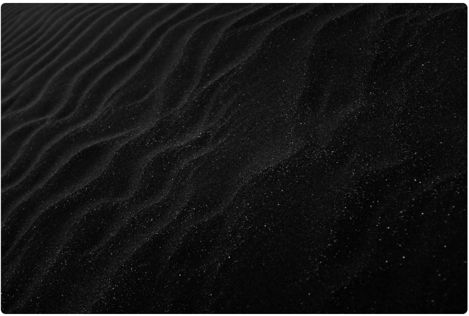

<!-- _header: "Product Documentation" -->
<!-- _footer: "24f1001129@ds.study.iitm.ac.in" -->

# Product Documentation  
**By: 24f1001129@ds.study.iitm.ac.in**

This presentation is written using **Marp**, fully version-controlled and exportable to PDF/HTML.

---

<!-- Custom styles using Marp directives -->

# Documentation Goals

- Clear onboarding for users  
- Maintainability in Git  
- Easy export to HTML/PDF  
- Support for diagrams, math, and themes

---

# Algorithmic Complexity

\[
T(n) = 3n^2 + 2n + 7 \quad \Rightarrow \quad O(n^2)
\]

---

<!-- Background image slide -->
<!-- _backgroundImage: url('images/bg.jpg') -->
# System Architecture Overview

This slide includes a **background image**.

---

# Product Diagram  
(Example image slide)

---

# Installation Steps

1. Clone the repository  
2. Install dependencies  
3. Run `npm run docs`  
4. Export using Marp CLI

---

# Custom Theme Example

This entire deck uses a **custom theme** defined in `theme.css`.

---

# Thank You  
**Contact:** 24f1001129@ds.study.iitm.ac.in
